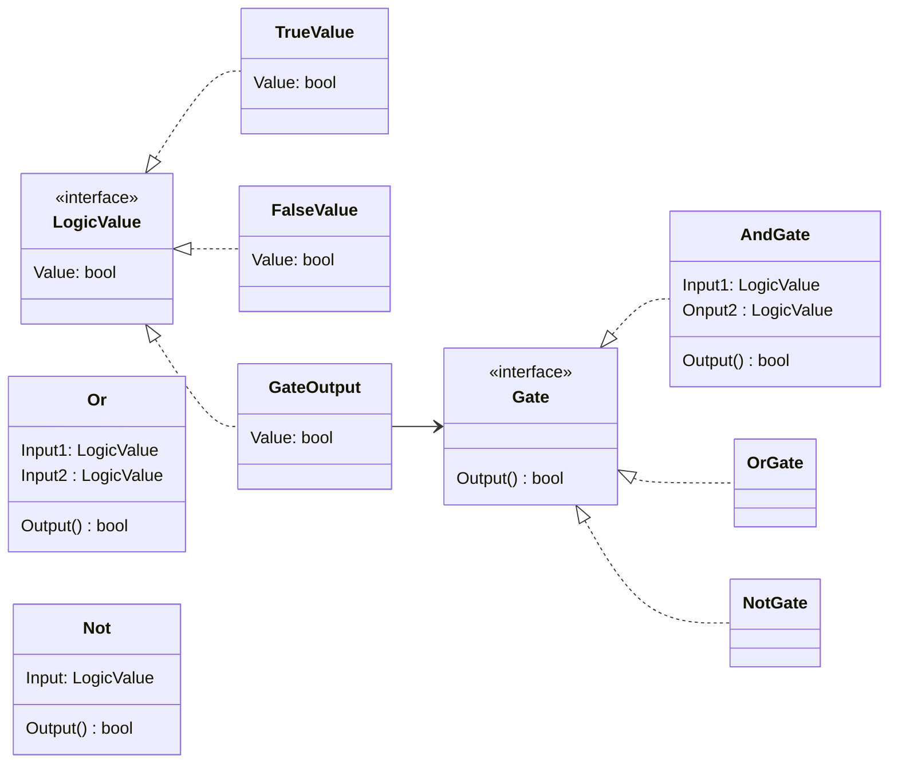

# Diagrama de clases

```mermaid
classDiagram
    direction LR

    class LogicValue {
        <<interface>>
        Value: bool
    }

    class TrueValue {
        Value: bool
    }

    class FalseValue {
        Value: bool
    }

    class GateOutput {
        Value: bool
    }

    class Gate{
        <<interface>>
        Output() bool
    }

    class AndGate{
        Input1: LogicValue
        Onput2 : LogicValue
        Output() bool
    }

    class Or{
        Input1: LogicValue
        Input2 : LogicValue
        Output() bool
    }

    class Not{
        Input: LogicValue
        Output() bool
    }

    %% Relaciones

    LogicValue <|.. TrueValue
    LogicValue <|.. FalseValue
    LogicValue <|.. GateOutput

    Gate <|.. AndGate
    Gate <|.. OrGate
    Gate <|.. NotGate

    GateOutput --> Gate
```
